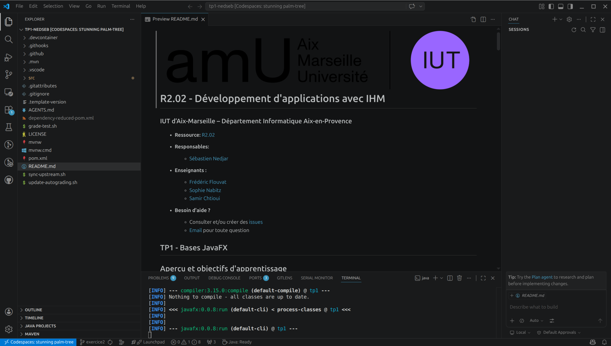
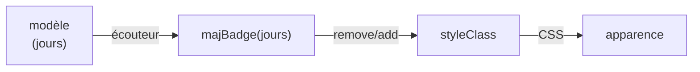
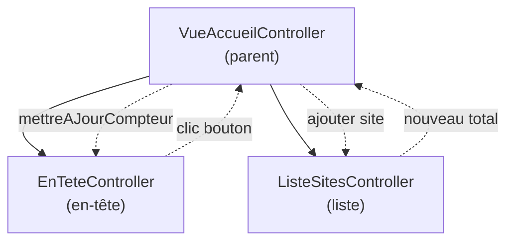
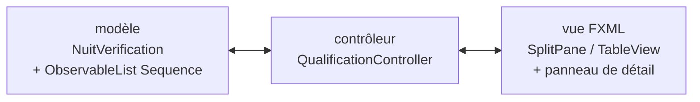

[](https://classroom.github.com/open-in-codespaces?assignment_repo_id=23937793)
#  R2.02 - Développement d'applications avec IHM

### IUT d'Aix-Marseille - Département Informatique Aix-en-Provence

* **Ressource :** [Syllabus R2.02](https://github.com/IUTInfoAix-R202/syllabus) (compétences, calendrier, évaluations, ressources détaillées)

* **Équipe pédagogique :**

  * [Sébastien Nedjar](mailto:sebastien.nedjar@univ-amu.fr) - responsable du module
  * [Frédéric Flouvat](mailto:frederic.flouvat@univ-amu.fr)
  * [Sophie Nabitz](mailto:sophie.nabitz@univ-avignon.fr)
  * [Samir Chtioui](mailto:samir.chtioui@gmail.com)

* **Besoin d'aide ?**
    * Consulter et/ou créer des [issues](https://github.com/IUTInfoAix-R202/tp3/issues)
    * [Email](mailto:sebastien.nedjar@univ-amu.fr) pour toute question


## TP3 - FXML

## Objectifs de la séance

### Ce que vous saurez faire à la fin de cette séance

Les exercices de ce TP sont organisés en progression. Cette progression suit la **taxonomie de Bloom**, un modèle pédagogique qui décrit les niveaux de maîtrise d'un savoir-faire du plus simple (comprendre un concept) au plus complexe (créer une application complète).

| Niveau Bloom | Exercices | Vous serez capable de... | Compétence BUT |
|---|---|---|---|
| **Comprendre** | 1-2 | charger une vue FXML et la relier à un contrôleur Java (`@FXML`, `fx:id`, `onAction`) | AC11.04 |
| **Appliquer** | 3-4 | construire un formulaire complet en FXML avec validation par bindings, et structurer la coquille d'une application (BorderPane + MenuBar + barre de statut) | AC11.04, AC12.02 |
| **Analyser** | 5-6 | concevoir un **composant graphique réutilisable** via `fx:root`, puis **composer plusieurs vues** via `fx:include` avec communication entre contrôleurs | AC11.02, AC11.04 |
| **Créer** | 7 + bonus 10 | mettre en place une **architecture MVC complète** (modèle métier + vue FXML + contrôleur) sur un cas d'usage de la SAÉ (ex 7) puis sur un cas ludique de complexité équivalente pour préparer le CC3 (bonus 10) | AC11.02, AC11.04, AC12.02 |

> Les **bonus 8 (theming CSS dynamique)** et **bonus 9 (SceneBuilder)** sont des extensions facultatives qui élargissent votre boîte à outils sans monter d'un cran dans la taxonomie de Bloom : à faire si vous voulez explorer plus loin une fois les 7 exercices terminés.

**Tout au long du TP**, vous pratiquez aussi le **workflow professionnel** (GitHub Classroom, Codespace, Maven, branche → Pull Request → review). Ces compétences sont formellement développées et évaluées en **R2.03 (Qualité de développement)**, module couplé à R2.02 par la SAÉ 2.01 commune.

### Lien avec la SAÉ 2.01 (VigieChiro PR Companion)

Les TP 1 et 2 vous ont appris à fabriquer une IHM JavaFX **entièrement en Java**. C'est lisible pour de petites fenêtres, mais ça devient vite ingérable quand les écrans s'enrichissent : une centaine de lignes pour décrire un formulaire, et la moindre modification visuelle oblige à recompiler. Au TP3, vous découvrez **FXML** : un format déclaratif où la structure visuelle vit dans un fichier `.fxml`, séparé du contrôleur Java qui ne porte plus que la logique. Cette séparation est la condition nécessaire pour construire une application **réelle** plutôt qu'un exercice jouet.

La SAÉ 2.01 vous demande de réaliser le [*VigieChiro PR Companion*](https://iutinfoaix-s201.github.io/brief/), le logiciel qui manque aux possesseurs de Passive Recorder pour traiter leurs nuits de capture de chauves-souris (client réel : [Samuel Busson, CEREMA](https://iutinfoaix-s201.github.io/brief/Analyse%20et%20conception/Personas/Samuel/)). Les exercices 3 à 7 de ce TP3 reproduisent volontairement, en miniature, les écrans clés de la SAÉ :

| TP3 | Écran SAÉ |
|---|---|
| Ex 3 - Formulaire de connexion + bindings de validation | gabarit du **formulaire « + Nouveau site »** (parcours [P1 - Déclarer un site de suivi](https://iutinfoaix-s201.github.io/brief/Analyse%20et%20conception/Parcours%20utilisateurs/P1%20-%20D%C3%A9clarer%20un%20site%20de%20suivi/)) |
| Ex 4 - Coquille `CoquilleAccueil` (BorderPane + MenuBar + barre de statut) | [**maquette M-Sites**](https://iutinfoaix-s201.github.io/brief/Analyse%20et%20conception/Maquettes/M-Sites/) : la coquille principale de l'application |
| Ex 5 - Composant `SiteCarte` avec badge de fraîcheur | la [**tuile récapitulative de site**](https://iutinfoaix-s201.github.io/brief/Analyse%20et%20conception/Maquettes/M-Sites/) (nom du site, badge de fraîcheur, statistiques) affichée pour chaque site déclaré |
| Ex 6 - `VueAccueil` en `fx:include` (en-tête + liste) | [**assemblage M-Sites**](https://iutinfoaix-s201.github.io/brief/Analyse%20et%20conception/Maquettes/M-Sites/) : on compose les briques de l'ex5 dans la coquille de l'ex4 |
| Ex 7 - Vérification d'enregistrement (pierre angulaire MVC) | parcours [**P3 - Vérifier l'enregistrement par échantillonnage**](https://iutinfoaix-s201.github.io/brief/Analyse%20et%20conception/Parcours%20utilisateurs/P3%20-%20V%C3%A9rifier%20l%27enregistrement%20par%20%C3%A9chantillonnage/) ([maquette M-Qualification](https://iutinfoaix-s201.github.io/brief/Analyse%20et%20conception/Maquettes/M-Qualification/)) : tableau de séquences + verdict global |

À la fin du TP3, vous aurez écrit dans un environnement contrôlé les briques que vous **réutiliserez et étendrez** en SAÉ. Le code de cette SAÉ est volumineux : si vous abordez la SAÉ sans avoir maîtrisé FXML et MVC, vous serez submergé. Si vous abordez la SAÉ en ayant écrit *de vos mains* une carte de site, une coquille avec menu, un assemblage par `fx:include` et une vue de validation MVC, vous aurez les automatismes nécessaires.

<details>
<summary><strong>Prérequis</strong> (connaissances et environnement) - déplier si besoin</summary>

#### Connaissances attendues

- **Bases de la programmation** : variables, types, structures de contrôle, tableaux : acquis en C++ dans la ressource R1.01.
- **Programmation orientée objet en Java** : classes, objets, héritage, interfaces, polymorphisme : acquis dans la ressource R2.01.
- **Bases de JavaFX procédural** : `Application`, `Stage`, `Scene`, `BorderPane`, `GridPane`, `HBox`, `VBox`, `MenuBar`, `EventHandler` : acquis au **TP1**.
- **Propriétés observables et bindings** : `IntegerProperty`, `StringProperty`, `Bindings.when/then/otherwise`, `bindBidirectional` : acquis au **TP2**. C'est ce socle qui rend les exercices 3 et 7 de ce TP possibles.

#### Environnement technique

L'ensemble du TP se fait sur **GitHub Codespaces** - aucune installation locale n'est nécessaire. L'environnement (Java 25, JavaFX 25, Maven, Git, Copilot Chat) est pré-configuré et prêt à l'emploi dès l'ouverture du Codespace.

> Pour une installation locale (facultative), voir le bloc dépliable en fin de document.

</details>

---

<details>
<summary><strong>Mise en place du Codespace</strong> (rappel TP1 / TP2) - déplier si besoin</summary>

La mise en place se fait en deux étapes : accepter le devoir sur GitHub Classroom (qui crée votre dépôt personnel), puis ouvrir ce dépôt dans un Codespace (votre environnement de développement dans le navigateur).

### Étape 1 - Accepter le devoir sur GitHub Classroom

1. Cliquez sur le lien suivant :

   👉 **https://classroom.github.com/a/furMyUIZ**

2. Si c'est votre première utilisation de GitHub Classroom, autorisez l'accès à votre compte GitHub.
3. Sélectionnez votre nom dans la liste des étudiants (si elle apparaît) pour associer votre compte GitHub à votre identité dans le cours.
4. Cliquez sur **"Accept this assignment"**.
5. Attendez quelques secondes - GitHub crée automatiquement un dépôt à votre nom : `IUTInfoAix-R202-2026/tp3-votreLogin`.
6. Cliquez sur le lien du dépôt créé pour y accéder.

### Étape 2 - Ouvrir le projet dans GitHub Codespaces

Une fois sur la page de votre dépôt :

1. Cliquez sur le bouton vert **"Code"** (en haut à droite du listing de fichiers).
2. Sélectionnez l'onglet **"Codespaces"**.
3. Cliquez sur **"Create codespace on main"**.


4. Attendez que l'environnement se construise (de 1 à 5 minutes la première fois).
5. VS Code s'ouvre **dans votre navigateur** avec tout l'environnement pré-configuré :
   - Java 25 + JavaFX 25
   - Maven (via le wrapper `./mvnw`)
   - Git
   - Copilot Chat (votre assistant IA pédagogique)
   - Toutes les extensions nécessaires



> [!IMPORTANT]
> Le Codespace est **personnel et persistant**. Quand vous fermez l'onglet, votre travail est sauvegardé. Pour reprendre, retournez sur votre dépôt GitHub → **"Code"** → **"Codespaces"** → cliquez sur le Codespace existant (ne créez pas un nouveau à chaque fois).

### Vérification rapide

Une fois le Codespace ouvert, ouvrez un terminal via le menu **Terminal → New Terminal** :


Puis lancez :

```bash
./mvnw test
```

Vous devriez voir un résultat du type :
```
Tests run: X, Failures: 0, Errors: 0, Skipped: X
BUILD SUCCESS
```

Si c'est le cas, tout est prêt. Le seul test actif (`AppTest`) passe, et les tests d'exercices sont en attente (`Skipped`) - c'est normal, ils seront activés au fil de votre progression.

</details>

---

<details>
<summary><strong>Comment vous êtes évalué·e</strong> (autograding /1000, rappel TP1 / TP2) - déplier si besoin</summary>

L'évaluation de ce TP est **entièrement automatique** : à chaque fois que vous poussez (`push`) votre code sur GitHub, un système d'autograding exécute tous vos tests et calcule un score sur **1000 points**.

- **100 points** sont attribués si le projet **compile** correctement
- **900 points** sont répartis entre les différents **tests des exercices** (chaque test vaut au moins 1 point)
- Un test `@Disabled` (non encore activé) rapporte **0 point** - c'est normal
- Un test activé et **qui passe** rapporte ses points
- Un test activé et **qui échoue** rapporte 0 point

Le score est **affiché brut sur 1000 par Classroom** (ex : `Points 250/1000`) et **ramené sur 20** au calcul final en divisant par 50. Votre note augmente progressivement au fil de votre avancement ; il n'y a pas de date limite brutale : chaque push met à jour votre score.

### Consulter votre note actuelle

Après chaque `push`, rendez-vous sur la page de votre dépôt GitHub → onglet **"Actions"** → dernier run du workflow **"GitHub Classroom Workflow"**. Le score apparaît dans le résumé :

```
Points 250/1000
```

Vous pouvez aussi voir le détail test par test pour savoir exactement quels exercices sont validés et lesquels restent à faire.

</details>

---

<details>
<summary><strong>Commandes Maven essentielles</strong> (rappel TP1 / TP2) - déplier si besoin</summary>

**Maven** est un outil de construction de projets Java utilisé dans la majorité des projets professionnels. Il gère automatiquement la compilation du code, le téléchargement des bibliothèques nécessaires (JavaFX, JUnit, TestFX...), l'exécution des tests et le packaging de l'application. Plutôt que de lancer `javac` et `java` à la main avec des dizaines d'options, une seule commande Maven suffit.

Dans ce projet, Maven est embarqué via un **Maven Wrapper** (`./mvnw`) : un script qui télécharge et utilise automatiquement la bonne version de Maven. Aucune installation n'est nécessaire : la première exécution prend quelques secondes de plus (téléchargement), puis tout est instantané.

| Commande | Effet |
|----------|-------|
| `./mvnw javafx:run` | Lance l'application JavaFX |
| `./mvnw test` | Exécute les tests unitaires |
| `./mvnw clean test` | Rebuild propre (supprime `target/` puis relance les tests) |
| `./mvnw clean` | Supprime les artefacts (`target/`) |
| `./mvnw spotless:apply` | Formate le code Java (Google Java Style) |

> [!NOTE]
> Le code est aussi formaté **automatiquement** avant chaque commit via un hook pre-commit invisible. Il n'est pas nécessaire de lancer `spotless:apply` à la main, sauf pour vérifier visuellement le formatage avant un commit.

</details>

---

<details>
<summary><strong>Workflow Git par exercice</strong> (branche / PR / merge, rappel TP1) - déplier si besoin</summary>

Chaque exercice suit le même cycle. Cette démarche structurée vous aide à travailler de manière **méthodique et professionnelle** : c'est exactement le workflow que vous utiliserez en entreprise.

**1. Créer une branche pour l'exercice**

```bash
git checkout -b exerciceN
```

**2. Activer le premier test** - ouvrez le fichier de test correspondant et retirez l'annotation `@Disabled` du premier test.

**3. Vérifier que le test est rouge**

```bash
./mvnw test
```

Le test doit échouer - c'est normal et attendu. Le message d'erreur vous indique ce que le test attend.

**4. Implémenter le minimum** pour faire passer ce test au vert. Pas plus que nécessaire.

**5. Vérifier que le test passe**

```bash
./mvnw test
```

**6. Lancer l'application** pour voir le résultat visuellement :

```bash
./mvnw javafx:run
```

Ou via `Ctrl+Shift+B` dans VS Code.

**7. Recommencer** - activez le test suivant (étapes 2 à 6) jusqu'à ce que tous les tests de l'exercice soient verts.

**8. Finaliser l'exercice** - quand tous les tests passent :

```bash
git add .
git commit -m "feat(exerciceN): termine l'exercice"
git push -u origin exerciceN
```

> Le format `feat(exerciceN): ...` suit la convention [Conventional Commits](https://www.conventionalcommits.org/fr/) découverte au TP1 : type (`feat`, `fix`, `docs`, `chore`...), scope entre parenthèses, puis résumé court à l'impératif.

**9. Créer une Pull Request** pour voir votre travail et recevoir une review automatique :

```bash
gh pr create --title "feat(exerciceN): termine l'exercice" --body "Tous les tests passent."
```

Ouvrez la PR dans le navigateur (`gh pr view --web`) pour consulter le diff, les checks CI, le score autograding et les commentaires de la review Copilot.

**10. Merger et passer à la suite** :

```bash
gh pr merge --rebase --delete-branch
```

Votre score sur GitHub Actions augmente à chaque exercice terminé. Vous pouvez maintenant passer à l'exercice suivant en reprenant à l'étape 1.

</details>

---

<details>
<summary><strong>Copilot Chat comme tuteur</strong> (rappel TP1 / TP2) - déplier si besoin</summary>

Vous avez le droit d'utiliser **Copilot Chat** (panneau latéral dans VS Code) quand vous bloquez sur un exercice. Il est configuré spécifiquement pour ce TP : il ne donnera pas la solution directement, mais vous guidera par étapes : d'abord une explication du concept, puis un pointeur vers la documentation, et seulement en dernier recours un minimum de code.

**Copilot Chat n'est pas un raccourci, c'est un tuteur.** Il vous aide à comprendre, pas à copier-coller. L'objectif est que vous soyez capable d'écrire ce code **en autonomie** à la fin de la séance.

**Pourquoi c'est important** : l'évaluation de ce module se fera **sur papier, sans aucun outil d'assistance**. Il est donc essentiel que vous construisiez vos automatismes en écrivant le code vous-même. Copilot Chat est un filet de sécurité pour débloquer, pas un substitut à la réflexion.

**Conseil pratique** : sur les premiers exercices, n'hésitez pas à demander de l'aide pour vous familiariser avec les concepts et le workflow. Sur les exercices avancés, essayez d'aller le plus loin possible par vous-même avant de solliciter l'assistant. C'est cette progression vers l'autonomie qui vous préparera le mieux aux évaluations.

</details>

---

<details>
<summary><strong>Lire les noms de tests</strong> (rappel TP1 / TP2 et R2.03) - déplier si besoin</summary>

Tout au long du TP, les méthodes de test suivent une même structure de nommage que vous lirez naturellement comme une phrase française : **`<sujet>_<action>_<conséquence>`**.

Quelques exemples concrets, extraits du TP :

| Nom de la méthode | Lecture |
|---|---|
| `le_compteur_affiche_zero_au_demarrage` | Le compteur affiche zéro au démarrage. |
| `cliquer_sur_le_bouton_plus_incremente_le_compteur_de_un` | Cliquer sur le bouton + incrémente le compteur de un. |
| `le_formulaire_avec_un_mot_de_passe_trop_court_garde_le_bouton_ok_desactive` | Le formulaire avec un mot de passe trop court garde le bouton OK désactivé. |
| `cliquer_sur_le_menu_mes_sites_change_le_titre_central` | Cliquer sur le menu Mes sites change le titre central. |
| `la_carte_avec_moins_de_sept_jours_affiche_un_badge_vert` | La carte avec moins de sept jours affiche un badge vert. |
| `cliquer_sur_nouveau_site_ajoute_une_carte_dans_la_liste` | Cliquer sur « + Nouveau site » ajoute une carte dans la liste. |
| `selectionner_une_sequence_active_le_bouton_ecouter` | Sélectionner une séquence active le bouton « Écouter ». |
| `un_pion_blanc_pose_au_bout_d_une_ligne_retourne_les_pions_noirs_encadres` | Un pion blanc posé au bout d'une ligne retourne les pions noirs encadrés. |

**Pourquoi cette forme ?**

- **Elle se lit toute seule.** Pas besoin d'aller voir le corps de la méthode pour comprendre ce qui est testé : le nom suffit.
- **Elle est exhaustive.** Le sujet (à qui on parle), l'action (ce qu'on fait) et la conséquence (ce qu'on attend) sont tous nommés.
- **Elle est en français.** Le code de production reste en anglais idiomatique (convention Java) mais les tests racontent l'histoire de votre code dans la langue dans laquelle vous pensez.

**Petites règles à retenir si vous écrivez de nouveaux tests :**

1. **`snake_case`** (mots séparés par `_`), pas `camelCase`. Plus lisible quand les noms s'allongent.
2. **Verbe conjugué à la 3e personne du singulier** : *le compteur affiche* (pas `afficher`), *la carte montre* (pas `montrer`).
3. **Forme négative avec `sans`** plutôt que `ne ... pas` : `valider_sans_remplir_le_formulaire_garde_le_bouton_desactive` plutôt que `valider_sans_remplir_le_formulaire_ne_clique_pas_sur_le_bouton`.
4. **Pas de verbe vague** comme `fonctionne` ou `marche`. Préférez le verbe précis qui décrit l'effet : `retourne_X`, `affiche_X`, `met_a_jour_X`, `active_X`, `desactive_X`, `ajoute_X`.
5. **La longueur n'est pas un problème, la lisibilité l'est.** Un nom de dix mots qui se lit comme une phrase est meilleur qu'un nom de trois mots qui force à ouvrir le corps du test.

> [!TIP]
> Cette forme transforme vos tests en **documentation exécutable**. Quand un collègue (ou vous-même dans six mois) lit la liste des tests d'une classe, il comprend en quelques secondes ce que la classe est censée faire et garantir, sans lire une seule ligne de code de test.

</details>

---

## Exercice 1 - Première vue FXML

**Objectif** : écrire une vue FXML minimale, puis l'afficher dans une fenêtre depuis le code Java.

**Ce que vous allez découvrir** :
- Le fichier FXML : un format XML qui décrit la **structure** d'une vue (les nœuds, leurs propriétés, leurs imbrications).
- La syntaxe de base d'un FXML : déclaration XML, balises `<?import ...?>` qui jouent le rôle des `import` Java, élément racine avec ses attributs `xmlns`, contenu imbriqué.
- La classe [`FXMLLoader`](https://openjfx.io/javadoc/25/javafx.fxml/javafx/fxml/FXMLLoader.html) : un chargeur qui transforme un fichier `.fxml` en un arbre d'objets JavaFX prêt à être affiché.
- L'organisation des ressources : le `.fxml` vit dans le même paquetage que la classe Java qui le charge (concrètement, à côté du fichier `.java` sous `src/main/java/...`).

**Le matériel fourni** dans le paquet `fr.univ_amu.iut.exercice1` (tous les fichiers vivent côte à côte sous `src/main/java/fr/univ_amu/iut/exercice1/`) :
- `PremiereVueFXML.java` : la classe `Application` à compléter (méthode `start(...)` vide).
- `PremiereVueFXML.fxml` : un **squelette de vue** à compléter. La racine `<BorderPane>` est déjà placée ainsi que les imports nécessaires (`Insets`, `Button`, `Label`, `BorderPane`) ; à vous d'ajouter le contenu (`<padding>`, `<top>`, `<center>`, `<bottom>`) en suivant les indications du commentaire TODO. Aucun `fx:controller` n'est nécessaire : la vue est purement statique, sans contrôleur ni logique associée.
- `PremiereVueFXMLTest.java` (sous `src/test/java/.../exercice1/`) : 6 tests TestFX, tous `@Disabled`, organisés en 3 étapes.

> [!NOTE]
> Le `pom.xml` est configuré pour que tout fichier non-`.java` placé dans `src/main/java/` soit copié dans le classpath au build. Conséquence : vos `.fxml`, `.css`, images… vivent directement à côté de la classe qui les utilise, et `getClass().getResource("MonFichier.fxml")` les trouve sans préfixe de chemin. Plus besoin de naviguer entre `src/main/java/` et `src/main/resources/`.

<details>
<summary><strong>📋 Mémo FXML</strong> (à garder ouvert pendant que vous écrivez le FXML)</summary>

Un fichier FXML, c'est trois zones :

```xml
<?xml version="1.0" encoding="UTF-8"?>           <!-- 1. déclaration XML obligatoire -->

<?import javafx.geometry.Insets?>                <!-- 2. imports : un par classe utilisée -->
<?import javafx.scene.control.Label?>            <!--    (équivalent des import Java)    -->
<?import javafx.scene.layout.VBox?>

<VBox xmlns="http://javafx.com/javafx/25"        <!-- 3. élément racine + namespaces FX  -->
      xmlns:fx="http://javafx.com/fxml/1"
      spacing="10">

  <padding>
    <Insets top="20" right="20" bottom="20" left="20"/>
  </padding>

  <Label text="Bonjour"                          <!-- propriétés = attributs XML         -->
         style="-fx-font-size: 20px;"/>          <!-- style CSS inline accepté           -->

  <Label text="ligne 2" wrapText="true"/>        <!-- les enfants vivent dans le contenu -->
</VBox>
```

**Règles à retenir** :
- Une seule balise racine. Tous les autres nœuds sont **imbriqués dans** la racine.
- Une propriété simple devient un **attribut** (`text="Bonjour"`, `prefWidth="420"`).
- Une propriété complexe (objet) devient une **balise enfant** (le `<padding>` ci-dessus, qui contient un `<Insets/>`).
- Dans un `BorderPane`, les zones `<top>`, `<center>`, `<bottom>`, `<left>`, `<right>` reçoivent chacune **un seul** nœud enfant.
- Les attributs **statiques** d'un layout parent se posent sur l'enfant : `BorderPane.alignment="CENTER"` sur un `Label` qui est dans un `BorderPane`. C'est l'équivalent FXML de `BorderPane.setAlignment(label, Pos.CENTER)`.
- Toute classe utilisée doit figurer dans un `<?import ...?>`. Le chemin complet (paquet inclus) est obligatoire.

Quand un attribut vous est inconnu, ouvrez la [Javadoc JavaFX 25](https://openjfx.io/javadoc/25/) sur la classe : les propriétés de la classe correspondent aux attributs FXML utilisables.

</details>

**Travail à faire** : compléter le FXML, puis implémenter la méthode `start(Stage primaryStage)`. Cinq gestes.

0. **Écrire le contenu du FXML** dans `PremiereVueFXML.fxml`. Le commentaire TODO en tête du fichier décrit précisément ce qui doit aller dans `<top>` (un `Label` titre stylé en gras 20 px), `<center>` (un `Label` explicatif avec `wrapText="true"`) et `<bottom>` (un `Button`). Ajoutez aussi un `<padding>` avec un `<Insets/>` de 20 px. Aidez-vous du mémo ci-dessus.
1. **Localiser le fichier FXML** depuis la classe Java avec `getClass().getResource("PremiereVueFXML.fxml")`. Comme la classe Java et le fichier FXML vivent dans le même paquetage, le nom court suffit : JavaFX résout automatiquement le chemin complet vers la ressource. La méthode retourne une `URL`.
2. **Charger le FXML** avec `FXMLLoader.load(url)`. Cette méthode lit le XML, instancie chaque balise comme un objet Java, applique les propriétés, et retourne la **racine** de l'arbre (un `Parent`, ici plus précisément un `BorderPane`).
3. **Créer une `Scene`** à partir de la racine et l'attacher au `Stage` via `setScene(...)`.
4. **Donner un titre** à la fenêtre (`setTitle(...)` : le titre attendu par le test 4 est précisé dans le message d'erreur si vous vous trompez), puis afficher la fenêtre via `show()`.

**Progression des tests**, à activer un par un dans l'ordre indiqué par l'annotation `@Order(...)` :

| Étape | Tests | Ce qui est vérifié | Geste qui les fait passer |
|---|---|---|---|
| 1 : la fenêtre s'ouvre | 1-2 | `stage.isShowing()` et `stage.getScene() != null` | gestes 3 (setScene) + 4 (show) |
| 2 : la racine vient bien du FXML | 3-4 | la racine est un `BorderPane` et le titre est `"Première vue FXML"` | gestes 1+2 (load) + setTitle |
| 3 : les composants du FXML sont là | 5-6 | un `Label` contenant « Bienvenue » et un `Button` sont présents dans l'arbre de scène | geste 0 (le FXML doit déclarer ces nœuds) |

> [!TIP]
> Pour voir le résultat, `./mvnw javafx:run` puis ouvrez la fenêtre [noVNC](https://github.com/IUTInfoAix-R202/tp1#voir-votre-fenêtre-avec-vnc) (port 6080 de l'onglet **PORTS**) et cliquez sur **Ex 1 - Première vue FXML** dans le **Lanceur**. Si le FXML est incomplet, vous obtiendrez une fenêtre vide ou un message d'erreur dans la console : le message indique la ligne fautive du XML, c'est votre meilleur outil de diagnostic.

---

## Exercice 2 - Compteur FXML avec contrôleur

**Objectif** : associer un **contrôleur Java** à une vue FXML, injecter les composants via `@FXML` et réagir à un `onAction`.

**Ce que vous allez découvrir** :
- L'attribut `fx:controller` sur le nœud racine du FXML : indique au `FXMLLoader` quelle classe instancier comme contrôleur.
- L'annotation `@FXML` sur un champ du contrôleur : le `FXMLLoader` injecte automatiquement le composant dont le `fx:id` correspond au nom du champ.
- L'attribut `onAction="#nomMethode"` sur un bouton : indique la méthode du contrôleur à appeler lors du clic (cette méthode doit être annotée `@FXML`).
- La méthode `initialize()` : appelée automatiquement par le `FXMLLoader` **après** l'injection des composants. C'est l'endroit canonique pour installer les bindings et la logique d'initialisation.

**Le matériel fourni** dans le paquet `fr.univ_amu.iut.exercice2` :
- `CompteurFXML.java` : la classe `Application`, **fournie complète**. Relisez-la pour réviser les 4 gestes de l'exercice 1 (URL de la ressource, `FXMLLoader.load`, `Scene`, `Stage`).
- `CompteurView.fxml` : un **squelette quasi vide** à compléter de bout en bout. À l'exercice 1 la racine et les imports vous étaient fournis ; ici vous écrivez tout. Le commentaire TODO en tête du fichier liste précisément les imports à déclarer, les attributs de la racine (dont la nouveauté **`fx:controller`**), et la composition `Label + HBox(Button, Button) + Button` avec les bons `fx:id` et `onAction`.
- `CompteurController.java` : le contrôleur, **avec déjà les quatre champs `@FXML` et les squelettes de méthodes**.
- `CompteurControllerTest.java` (sous `src/test/java/.../exercice2/`) : 7 tests TestFX, tous `@Disabled`, organisés en 4 étapes.

L'**état observable** du compteur (sa valeur courante) est déjà déclaré dans le contrôleur :

```java
private final IntegerProperty compteur = new SimpleIntegerProperty(0);
```

> [!NOTE]
> Dans une architecture MVC stricte, cet état appartiendrait à une classe modèle séparée (par exemple `CompteurModele.java`), distincte du contrôleur. Ici on garde tout dans le contrôleur pour rester concentré sur le câblage FXML ↔ contrôleur, qui est la vraie nouveauté de cet exercice. La **séparation explicite vue / contrôleur / modèle** est introduite à l'exercice 7 (pierre angulaire MVC).

**Travail à faire** : écrire le FXML, puis remplir le corps des quatre méthodes du contrôleur. Cinq gestes.

0. **Écrire la vue FXML** dans `CompteurView.fxml`. Reprenez la syntaxe vue à l'exercice 1 (déclaration XML, imports, racine, contenu imbriqué), et ajoutez les trois nouveautés de cet exercice : **`fx:controller`** sur la racine (qui pointe sur `fr.univ_amu.iut.exercice2.CompteurController`), un **`fx:id`** sur chaque composant que le contrôleur doit pouvoir manipuler, et un **`onAction="#nomMethode"`** sur chaque bouton (le `#` est obligatoire ; le nom doit correspondre à une méthode `@FXML` du contrôleur). Le commentaire TODO du fichier donne les `fx:id` et noms de méthode exacts attendus par les tests.
1. **`initialize()` : lier la vue à la propriété observable.** Le `FXMLLoader` invoque cette méthode automatiquement, après avoir injecté les 4 champs `@FXML`. C'est l'endroit canonique pour poser un **binding unidirectionnel** entre la propriété observable et la propriété texte du label. Indice : `IntegerProperty` propose une méthode `asString()` qui retourne un `StringBinding` tout prêt.
2. **`incrementer()` : action du bouton +.** Il suffit d'augmenter la valeur portée par `compteur` de 1 (utilisez ses méthodes `get()` et `set(...)`). **Aucun appel à `labelCompteur.setText(...)` n'est nécessaire** : le binding posé en étape 1 propage la mise à jour vers la vue. C'est exactement le bénéfice qu'on veut faire ressentir.
3. **`decrementer()` : action du bouton −.** Symétrique : diminuer la valeur portée par `compteur` de 1.
4. **`reinitialiser()` : action du bouton « Réinitialiser ».** Remettre `compteur` à zéro.

**Progression des tests**, à activer un par un :

| Étape | Tests | Ce qui est vérifié | Geste qui les fait passer |
|---|---|---|---|
| 1 : structure FXML + état initial | 1 | le `Label` avec `fx:id="labelCompteur"` existe et affiche `"0"` au démarrage | geste 0 (FXML avec `fx:id`) + geste 1 (binding) |
| 2 : incrément | 2-4 | le `Button` avec `fx:id="boutonIncrementer"` existe et 1 puis 3 clics affichent `"1"` puis `"3"` | geste 0 (`fx:id` + `onAction="#incrementer"`) + geste 2 |
| 3 : décrément | 5-6 | un clic sur `−` affiche `"-1"` ; `+ + − −` revient à `"0"` | geste 0 + geste 3 |
| 4 : réinitialisation | 7 | après 3 clics sur `+` puis 1 clic sur « Réinitialiser », le label affiche `"0"` | geste 0 + geste 4 |

> [!TIP]
> Pour voir le résultat, `./mvnw javafx:run` puis ouvrez la fenêtre [noVNC](https://github.com/IUTInfoAix-R202/tp1#voir-votre-fenêtre-avec-vnc) (port 6080 de l'onglet **PORTS**) et cliquez sur **Ex 2 - Compteur FXML** dans le **Lanceur**. Si vous oubliez le binding dans `initialize()`, le label restera figé à `"0"` même après un clic : un bon indice que la vue n'est pas connectée au modèle.

> [!NOTE]
> Trois points de vocabulaire à intégrer dès cet exercice, parce qu'ils reviendront à chaque exercice du TP :
> - **`fx:controller`** sur la racine FXML : indique au `FXMLLoader` quelle classe instancier comme contrôleur. Cette ligne **apparie** la vue et le contrôleur.
> - **`fx:id="nom"`** sur un composant + **`@FXML private Type nom;`** dans le contrôleur (nom **identique**) : l'instance créée par le FXMLLoader est injectée dans le champ Java. Pas de `new Label()` à faire à la main.
> - **`onAction="#nomMethode"`** sur un bouton + **`@FXML private void nomMethode() { ... }`** dans le contrôleur (encore le même nom) : le clic appelle la méthode. Le `#` est obligatoire.

---

## Exercice 3 - Formulaire de connexion avec CSS et bindings

**Objectif** : construire un formulaire complet en FXML (`GridPane` + `Label` + `TextField` + `Button`), lui appliquer une **feuille CSS**, et écrire les **bindings de validation** dans le contrôleur.

**Ce que vous allez découvrir** :
- L'attribut `stylesheets="@FormulaireConnexion.css"` sur la racine du FXML : charge une feuille CSS locale (le `@` signifie « chemin relatif au FXML »).
- L'attribut `styleClass="..."` sur un nœud : équivalent FXML de `getStyleClass().add(...)`. Les classes CSS portent la décoration visuelle des composants.
- La création d'un `BooleanBinding` **bas niveau** (sous-classe anonyme avec `computeValue()`) quand les opérateurs `Bindings.greaterThan`, `Bindings.and`, etc., ne suffisent pas à exprimer la règle métier.

**Pont avec le TP2** : la règle de validation du mot de passe (≥ 8 caractères, au moins une majuscule, au moins un chiffre) est exactement celle de l'exercice 6 du TP2. La nouveauté ici n'est pas la règle elle-même, c'est de l'**installer dans un contrôleur FXML** plutôt que dans une méthode `createBindings()` appelée depuis `start()`.

**Le matériel fourni** dans le paquet `fr.univ_amu.iut.exercice3` :
- `FormulaireConnexionFXML.java` : la classe `Application`, **fournie complète**. Mêmes 4 gestes qu'aux exercices 1 et 2, pas de surprise.
- `FormulaireConnexionView.fxml` : la vue est **fournie complète**, rien à modifier dedans. Prenez le temps de la lire : repérez la balise `<GridPane>` avec ses positions `GridPane.rowIndex`/`columnIndex` (nouveau si vous ne connaissez que `BorderPane`/`VBox`/`HBox`), l'attribut `stylesheets="@FormulaireConnexion.css"` qui rattache la feuille de style locale (`@` signifie « relatif au FXML »), les `styleClass` qui décorent les nœuds, les 5 `fx:id` et les 2 `onAction`. Pour `<PasswordField>` ou `GridPane.columnSpan`, ouvrez la [Javadoc JavaFX 25](https://openjfx.io/javadoc/25/).
- `FormulaireConnexion.css` : la feuille de style **fournie complète**. À ouvrir et lire : repérez les sélecteurs `.formulaire`, `.formulaire .text-field:focused`, `.formulaire .button.primary`... C'est la première occasion concrète d'observer comment un sélecteur CSS s'accroche à une `styleClass` posée dans le FXML.
- `FormulaireConnexionController.java` : le contrôleur, avec déjà les cinq champs `@FXML` injectés. C'est le seul fichier à compléter.
- `FormulaireConnexionControllerTest.java` (sous `src/test/java/.../exercice3/`) : 12 tests TestFX, tous `@Disabled`, organisés en 5 étapes.

**Les règles de validation à installer dans `initialize()`** (identiques à l'exercice 6 du TP2) :
1. le champ `champMotDePasse` n'est **éditable** que si `champIdentifiant` contient au moins 6 caractères ;
2. le bouton « Annuler » est **désactivé** si les deux champs sont vides ;
3. le bouton « OK » est **désactivé** tant que le mot de passe ne respecte pas les trois critères : longueur ≥ 8, au moins une majuscule, au moins un chiffre.

**Travail à faire** : compléter les trois méthodes du contrôleur. Cinq gestes au total.

1. **`initialize()` règle 1 : éditabilité du mot de passe.** Lier `champMotDePasse.editableProperty()` à une expression booléenne « la longueur du texte d'identifiant est supérieure ou égale à 6 ». Indice : `champIdentifiant.textProperty()` expose une propriété `length()` (un `IntegerExpression`), et la classe `Bindings` fournit un opérateur `greaterThanOrEqual(..., 6)`.

2. **`initialize()` règle 2 : désactivation d'Annuler.** Lier `boutonAnnuler.disableProperty()` à « identifiant vide ET mot de passe vide ». Indice : `Bindings.and(...)` combine deux expressions booléennes, et la propriété `length()` d'un `textProperty()` se compare à zéro.

3. **`initialize()` règle 3 : désactivation de OK.** Le premier critère (longueur ≥ 8) pourrait à la rigueur s'écrire avec `Bindings.greaterThanOrEqual(...length(), 8)`. Mais « contient au moins une majuscule » et « contient au moins un chiffre » exigent de **parcourir le texte caractère par caractère** : ce sont des prédicats Java qu'aucun opérateur algébrique de `Bindings.*` n'encapsule. Composer trois opérateurs distincts coûterait plus de lignes que d'écrire la règle d'un bloc. On descend donc d'un cran et on crée une **sous-classe anonyme** de `BooleanBinding` :
   - un bloc d'initialisation qui appelle `super.bind(champMotDePasse.textProperty())` pour **déclarer les propriétés observées** (le binding se recalcule à chaque frappe) ;
   - une méthode `computeValue()` qui **retourne la valeur calculée** : `true` quand le mot de passe est **invalide** (`length() < 8`, ou aucune majuscule, ou aucun chiffre). Indice : `String.chars().noneMatch(Character::isUpperCase)` et `Character::isDigit`.

   Lier ensuite `boutonOk.disableProperty()` à ce binding.

   > Aparté : `Bindings.createBooleanBinding(supplier, dépendances...)` fait la même chose avec une lambda. On prend ici la sous-classe anonyme parce qu'elle rend visible la mécanique de tout binding : déclaration des dépendances d'un côté (`super.bind(...)`), fonction de calcul de l'autre (`computeValue()`). C'est exactement ce que cachent les `Bindings.*` du TP2 sous le capot.

4. **`valider()` : afficher l'identifiant et un mot de passe masqué.** Construire une chaîne avec autant de `*` qu'il y a de caractères dans `champMotDePasse.getText()`, puis poser `labelMessage.setText(identifiant + " " + masque)`. Le test 11 attend exactement le format `"alice1 ********"` pour un mot de passe de 8 caractères.

5. **`annuler()` : remettre le formulaire à zéro.** Vider les trois `Label`/`TextField`/`PasswordField` (`setText("")`). Les bindings posés en `initialize()` repassent automatiquement le mot de passe en non-éditable et désactivent les boutons : aucune logique de réinitialisation à dupliquer ici.

**Progression des tests**, à activer un par un :

| Étape | Tests | Ce qui est vérifié | Geste qui le fait passer |
|---|---|---|---|
| 1 : contrôles présents | 1-2 | les 4 `fx:id` (`champIdentifiant`, `champMotDePasse`, `boutonOk`, `boutonAnnuler`) sont bien dans l'arbre | aucun code (FXML déjà rédigé) |
| 2 : état initial | 3-5 | au démarrage : mdp non éditable, OK désactivé, Annuler désactivé | gestes 1, 3, 2 (les bindings sont posés dès `initialize()`) |
| 3 : éditabilité du mdp | 6 | un identifiant qui passe de 5 à 6 caractères rend le mdp éditable | geste 1 |
| 4 : validité du mdp | 7-10 | trois mots de passe invalides (trop court, sans majuscule, sans chiffre) gardent OK désactivé ; un mdp valide active OK | geste 3 |
| 5 : actions | 11-12 | OK affiche `"alice1 ********"` dans le label ; Annuler vide les 3 zones | gestes 4 et 5 |

> [!TIP]
> Pour voir le résultat, `./mvnw javafx:run` puis ouvrez la fenêtre [noVNC](https://github.com/IUTInfoAix-R202/tp1#voir-votre-fenêtre-avec-vnc) (port 6080 de l'onglet **PORTS**) et cliquez sur **Ex 3 - Formulaire de connexion** dans le **Lanceur**. Tapez 5 caractères dans l'identifiant : le champ mot de passe reste grisé. Tapez le 6e : il s'active. Sans les bindings, ces feedbacks visuels sont muets et le test 6 est le plus parlant pour s'en rendre compte.

> [!NOTE]
> Le pattern « `BooleanBinding` bas niveau » (étape 3) reviendra à chaque fois que la règle métier dépasse les opérateurs `Bindings.*`. C'est l'outil canonique en JavaFX pour exprimer une validation arbitraire sur du texte ou des collections : `super.bind(...)` déclare les propriétés à observer, `computeValue()` retourne la nouvelle valeur calculée à partir d'elles.

---

## Exercice 4 - Coquille principale de l'application (maquette M-Sites)

**Objectif** : construire la **coquille** d'une application JavaFX complète en FXML : `BorderPane` avec un `MenuBar` en haut, une zone centrale dynamique, et une barre de statut en bas.

**Ce que vous allez découvrir** :
- L'écriture déclarative d'un `BorderPane` en FXML : `<top>`, `<center>`, `<bottom>` reçoivent chacun **un seul** nœud (souvent un `VBox` ou un `HBox`).
- La déclaration d'un `MenuBar` avec ses `Menu` et `MenuItem`. Chaque `MenuItem` peut porter son propre `onAction="#nomMethode"`.
- La gestion des **espaces extensibles** dans un `HBox` : un `Region` avec `HBox.hgrow="ALWAYS"` pousse les éléments suivants à droite (équivalent FXML de l'astuce Java `HBox.setHgrow(espaceExtensible, Priority.ALWAYS)`).

**Pont avec le TP1** : vous avez construit ce type de mise en page **entièrement en Java** au TP1 exercice 4 (`new BorderPane(); root.setTop(menuBar); ...`). Ici, vous obtenez le même résultat sans une seule ligne de Java pour créer des nœuds. Ouvrez les deux fichiers côte à côte pour mesurer la différence.

**Lien SAÉ** : cette coquille reproduit la maquette **M-Sites** du brief VigieChiro. Les quatre rubriques du menu Affichage (« Mes sites », « Importer une nuit », « Vue tabulaire », « Paramètres ») correspondent à la navigation principale attendue par les personas Marie, Karim et Samuel.

**Le matériel fourni** dans le paquet `fr.univ_amu.iut.exercice4` :
- `CoquilleAccueil.java` : la classe `Application`, **fournie complète** (mêmes 4 gestes que dans les exercices précédents).
- `CoquilleAccueilView.fxml` : la coquille est **fournie complète**, rien à modifier dedans. Lisez-la : repérez la structure `<top>/<center>/<bottom>` du `BorderPane`, la déclaration des `<MenuBar>` / `<Menu>` (déjà vus au TP1 ex 4, mais cette fois en FXML déclaratif) qui contiennent chacun des `<MenuItem>` (nouveauté) avec leur propre `onAction="#nomMethode"` (le même mécanisme que sur un `<Button>`, appliqué cette fois à un item de menu), et l'astuce du `<Pane HBox.hgrow="ALWAYS"/>` qui sépare le contenu gauche du contenu droit dans le pied de fenêtre. Pour `MenuItem` ou les contraintes statiques `BorderPane.alignment` / `HBox.hgrow`, ouvrez la [Javadoc JavaFX 25](https://openjfx.io/javadoc/25/) si nécessaire.
- `CoquilleAccueilController.java` : 2 champs `@FXML` (`labelTitre`, `labelStatut`) déjà déclarés, 5 handlers squelettes à compléter.
- `CoquilleAccueilControllerTest.java` (sous `src/test/java/.../exercice4/`) : 8 tests TestFX, tous `@Disabled`.

**Travail à faire** : compléter les 5 méthodes d'action du contrôleur. Quatre d'entre elles ont exactement la même forme (changer le titre central, écrire dans la barre de statut) ; la cinquième ferme la fenêtre.

- **Les quatre méthodes de navigation** (`onMesSites`, `onImporter`, `onVueTabulaire`, `onParametres`) : chacune pose deux `setText(...)`, l'un sur `labelTitre`, l'autre sur `labelStatut`. Les **chaînes exactes attendues** sont indiquées dans le commentaire TODO de chaque méthode (et reprises mot pour mot par les assertions des tests 4 à 8). Restez fidèle à ces chaînes : les tests font des comparaisons strictes.
- **`onQuitter`** : fermer la fenêtre courante. Subtilité utile à retenir : un contrôleur n'a pas de référence directe à son `Stage`. On le remonte en passant par un `Node` injecté (par exemple `labelTitre`), via `getScene().getWindow()`, puis on appelle `hide()` (ou `close()` après cast en `Stage`) dessus.

**Progression des tests**, à activer un par un :

| Étape | Tests | Ce qui est vérifié | Geste qui le fait passer |
|---|---|---|---|
| 1 : structure FXML | 1-3 | `labelTitre` en place avec son texte initial, `labelStatut` présent, `MenuBar` avec « Fichier » et « Affichage » | aucun code (FXML déjà rédigé) |
| 2 : 4 rubriques | 4-7 | chaque item du menu Affichage met à jour `labelTitre` avec sa chaîne attendue | les 4 méthodes de navigation |
| 3 : barre de statut reflète la rubrique | 8 | un clic met aussi à jour `labelStatut` | `onImporter` (contrôlé via le statut) |

Notez que **`onQuitter` n'a pas de test associé** : la fermeture de la fenêtre est difficile à vérifier en TestFX sans tuer l'environnement de test. Implémentez-le quand même, vous le validerez visuellement.

> [!TIP]
> Pour voir le résultat, `./mvnw javafx:run` puis ouvrez la fenêtre [noVNC](https://github.com/IUTInfoAix-R202/tp1#voir-votre-fenêtre-avec-vnc) (port 6080 de l'onglet **PORTS**) et cliquez sur **Ex 4 - Coquille principale** dans le **Lanceur**. Naviguez dans le menu *Affichage* : le titre change au centre, la barre de statut trace la dernière rubrique cliquée. Testez ensuite *Fichier > Quitter* pour vérifier que la fenêtre se ferme proprement.

> [!NOTE]
> L'astuce du **`Pane` avec `HBox.hgrow="ALWAYS"`** dans la barre de statut mérite qu'on s'y arrête : ce `Pane` vide entre les deux `Label` joue le rôle d'**espace extensible**. Le `Label` de gauche reste collé à gauche, celui de droite est poussé à droite. C'est l'équivalent FXML de l'astuce Java `HBox.setHgrow(espaceExtensible, Priority.ALWAYS)` que vous reverrez à chaque fois qu'une barre d'outils, un pied de fenêtre ou un en-tête doit séparer un contenu gauche d'un contenu droit.

---

## Exercice 5 - Composant réutilisable `SiteCarte` (`fx:root`)

**Objectif** : créer un **composant graphique réutilisable** : une **tuile récapitulative de site** avec numéro de carré, nom, badge de fraîcheur coloré, et statistiques (c'est l'objet introduit dans le tableau SAÉ en haut du TP). La tuile expose des **propriétés observables** auxquelles l'utilisateur peut se brancher en Java.

**Ce que vous allez découvrir** :
- Le pattern `<fx:root type="..."/>` : le FXML ne déclare pas de classe racine concrète, mais un **type abstrait** que le code Java fournira via `FXMLLoader.setRoot(this)`. La même classe joue le rôle de racine **et** de contrôleur.
- L'usage du `FXMLLoader` **en instance** (`new FXMLLoader(url)`, `setRoot(...)`, `setController(...)`, `load()`), à comparer avec la forme statique `FXMLLoader.load(url)` vue à l'exercice 1.
- La **manipulation dynamique des classes CSS** côté Java : `node.getStyleClass().add("...")`, `.remove("...")`, `.removeAll(...)`. Le badge change de couleur sans qu'aucune ligne de code ne touche directement à la couleur : on se contente d'échanger la classe CSS, c'est le `.css` qui définit l'apparence.
- `StringProperty` / `SimpleStringProperty` : strictement analogues à `IntegerProperty` / `SimpleIntegerProperty` (vus au TP2), juste pour du texte.

**Ce que vous remettez en pratique** (acquis du TP2, mais sur un cas plus complet) :
- La **convention JavaBeans** pour exposer une propriété observable : `xxxProperty()` (la propriété), `getXxx()` (lecture), `setXxx(...)` (écriture). C'est ce triplet que les outils, les bindings et l'écosystème JavaFX attendent. Le composant en expose ici **cinq** au lieu d'une au TP2, et tous les types se mélangent (String, Integer).
- `ChangeListener` (TP2 CM2 #32-35) : on en pose un sur `joursDepuisDernierPassage` pour déclencher `majBadge(...)` à chaque modification.



**Lien SAÉ** : chaque site Vigie-Chiro déclaré dans l'application sera rendu sous forme d'une telle tuile sur l'écran d'accueil. La couleur du badge (vert / orange / gris) permet à l'utilisateur de repérer instantanément quels sites ont été traités récemment et lesquels traînent.

**Le matériel fourni** dans le paquet `fr.univ_amu.iut.exercice5` :
- `SiteCarte.fxml` : la vue est **fournie complète**, rien à modifier dedans. Lisez-la attentivement : c'est la **grande nouveauté** de cet exercice. Repérez la balise racine `<fx:root type="javafx.scene.layout.HBox">` (qui remplace la classe concrète habituelle), l'absence intentionnelle de `fx:controller` (la racine ET le contrôleur sont déclarés en Java), les 5 `fx:id`, et la structure visuelle (bloc identité, espace extensible `Region HBox.hgrow="ALWAYS"`, deux blocs stats). Pour comprendre `fx:root`, consultez la [Javadoc `FXMLLoader`](https://openjfx.io/javadoc/25/javafx.fxml/javafx/fxml/FXMLLoader.html) et l'[Introduction to FXML, section *Root Elements*](https://openjfx.io/javadoc/25/javafx.fxml/javafx/fxml/doc-files/introduction_to_fxml.html).
- `SiteCarte.css` : la feuille de style **fournie complète**. Ouvrez-la et repérez les trois classes du badge : `badge-fresh` (vert), `badge-stale` (orange), `badge-cold` (gris). Votre code Java n'aura pas à coder une seule couleur : il basculera simplement la bonne classe, et c'est ce CSS qui peindra.
- `SiteCarte.java` : la classe à compléter. Elle étend `HBox` (la racine FXML) et joue **à la fois** le rôle de racine visuelle et de contrôleur. Les 5 champs `@FXML` et les 5 propriétés observables sont déjà déclarés, avec leurs accesseurs / modificateurs / méthodes `xxxProperty()` selon la convention JavaBeans.
- `SiteCarteDemo.java` : une petite démo qui instancie 3 tuiles (une fraîche, une orange, une grise « Jamais utilisé »). Utile pour valider visuellement une fois l'exercice fini.
- `SiteCarteTest.java` (sous `src/test/java/.../exercice5/`) : 8 tests TestFX, tous `@Disabled`.

**Les 5 propriétés observables exposées par la tuile** (déjà déclarées, à utiliser depuis vos bindings) :
- `numeroCarre` (`StringProperty`, ex. « Carré 640380 »)
- `nomConvivial` (`StringProperty`, ex. « 📍 Étang de la Tuilière »)
- `nombrePoints` et `nombrePassages` (`IntegerProperty`)
- `joursDepuisDernierPassage` (`IntegerProperty`, où `-1` signifie « aucun passage importé »)

**Travail à faire** : compléter les trois méthodes du composant.

1. **Constructeur `SiteCarte()` : déclencher le chargement FXML en pattern `fx:root`.** Contrairement à un FXML classique où `FXMLLoader.load(url)` crée et l'arbre de scène et le contrôleur, ici **la racine de l'arbre et le contrôleur sont déjà créés** : c'est `this`. Il faut donc instancier explicitement un `FXMLLoader`, lui dire que la racine de l'arbre de scène de la vue est `this` (en appelant `setRoot`), que le contrôleur est aussi `this` (avec la méthode `setController`), **puis** appeler `load()`. La méthode `load()` peut lever une `IOException` : pour ne pas alourdir la signature du constructeur, repropagez-la enveloppée dans une `RuntimeException`.

2. **`initialize()` : lier les labels aux propriétés et brancher l'écouteur du badge.** Le `FXMLLoader` invoque cette méthode juste après l'injection des 5 `@FXML`. Quatre liaisons unidirectionnelles `label.textProperty().bind(...)` à poser :
   - `labelCarre` ↔ `numeroCarre` (binding direct)
   - `labelNom` ↔ `nomConvivial` (binding direct)
   - `labelNbPoints` ↔ `nombrePoints` + suffixe `" points d'écoute"`
   - `labelNbPassages` ↔ `nombrePassages` + suffixe `" passages"`

   Ajouter ensuite un `ChangeListener` sur `joursDepuisDernierPassage` qui appelle `majBadge(nouvelleValeur)` à chaque changement. Pour finir appeler `majBadge(...)` avec la valeur courante pour initialiser l'affichage (sans cette amorce, le badge resterait vide tant qu'aucun changement n'a eu lieu).

3. **`majBadge(int jours)` : poser le texte et la classe CSS du badge.** Suivre cet ordre :
   1. **Retirer** les trois classes éventuellement déjà présentes (`labelBadge.getStyleClass().removeAll("badge-fresh", "badge-stale", "badge-cold")`). Sans ce retrait préalable une tuile passant de fraîche à froide cumulerait les classes au lieu d'en changer.
   2. **Décider** parmi 4 cas et **ajouter** la bonne classe :
      - `jours < 0` : texte `"Jamais utilisé"`, classe `badge-cold`
      - `jours < 7` : texte `"Il y a Nj"`, classe `badge-fresh`
      - `jours <= 30` : texte `"Il y a Nj"`, classe `badge-stale`
      - sinon : texte `"Il y a Nj"`, classe `badge-cold`

**Progression des tests**, à activer un par un :

| Étape | Tests | Ce qui est vérifié | Geste qui le fait passer |
|---|---|---|---|
| 1 : la tuile se monte et affiche les propriétés | 1-3 | numéro, nom et compteurs (« 3 points d'écoute », « 7 passages ») apparaissent dans les bons labels quand on alimente la tuile depuis Java | gestes 1 (constructeur) + 2 (bindings 1 à 4) |
| 2 : le badge prend la bonne couleur | 4-7 | 4 plages : `< 7j` → vert, `7..30j` → orange, `> 30j` → gris, `-1` → gris avec « Jamais utilisé » | geste 3 + appel initial dans `initialize()` |
| 3 : le badge réagit aux changements à chaud | 8 | passer de 2 à 45 jours retire bien `badge-fresh` et ajoute `badge-cold` (preuve que le `removeAll` ET l'écouteur fonctionnent) | écouteur du geste 2 + `removeAll` du geste 3 |

> [!TIP]
> Pour voir le résultat, `./mvnw javafx:run` puis ouvrez la fenêtre [noVNC](https://github.com/IUTInfoAix-R202/tp1#voir-votre-fenêtre-avec-vnc) (port 6080 de l'onglet **PORTS**) et cliquez sur **Ex 5 - SiteCarte (démo M-Sites)** dans le **Lanceur**. La démo affiche 3 tuiles empilées : une avec un badge vert (2 jours), une avec un badge orange (8 jours), une avec un badge gris « Jamais utilisé ». Si le badge est vide ou toujours de la même couleur, vérifiez (a) que vous appelez bien `majBadge(...)` une fois en sortie d'`initialize()`, (b) que vous faites le `removeAll` avant le `add`.

> [!NOTE]
> Le pattern **`fx:root`** est celui qui permet de traiter un FXML comme un **composant réutilisable**, instanciable par `new SiteCarte()` partout où il le faut. Sans `fx:root`, le FXML produirait un nouvel arbre à chaque `load()` et ne pourrait pas être étendu ni typé statiquement. 
---

## Exercice 6 - Assembler des vues avec `fx:include`

**Objectif** : composer une application à partir de **deux sous-vues FXML** chacune avec son propre contrôleur. Faire dialoguer les sous-contrôleurs via un contrôleur parent.

**Ce que vous allez découvrir** :
- L'élément `<fx:include source="..." fx:id="..."/>` : insère une sous-vue dans la vue parente. Chaque sous-vue garde son propre `fx:controller`.
- L'**injection automatique des sous-contrôleurs** dans le contrôleur parent : pour chaque `fx:include` portant `fx:id="enTete"`, le parent reçoit deux champs `@FXML` : `enTete` (le nœud racine de la sous-vue) et `enTeteController` (l'instance de son contrôleur). Le suffixe `Controller` est figé : c'est la constante `FXMLLoader.CONTROLLER_SUFFIX` (`public static final String`), concaténée littéralement au `fx:id`. Pas paramétrable.
- L'**indépendance** des sous-contrôleurs : `EnTeteController` ne sait pas que `ListeSitesController` existe. C'est `VueAccueilController` qui les connecte. Cette discipline rend chaque brique testable isolément.



**Lien SAÉ** : on assemble ici la tuile `SiteCarte` (exercice 5) à l'intérieur d'un panneau liste, surmonté d'un en-tête (titre + bouton « + Nouveau site »). C'est exactement la composition M-Sites du brief Vigie-Chiro.

**Le matériel fourni** dans le paquet `fr.univ_amu.iut.exercice6` :
- `VueAccueil.java` : la classe `Application`, **fournie complète** (mêmes 4 gestes qu'aux exercices précédents).
- `VueAccueilView.fxml` : la vue parente, **fournie complète**. Un simple `BorderPane` qui inclut deux sous-vues via `<fx:include source="EnTeteView.fxml" fx:id="enTete"/>` en `<top>` et `<fx:include source="ListeSitesView.fxml" fx:id="listeSites"/>` en `<center>`. Lisez-la : c'est le geste minimum pour comprendre `<fx:include>`.
- `EnTeteView.fxml` et `ListeSitesView.fxml` : les deux sous-vues, **fournies complètes**. Chacune déclare son propre `fx:controller` et ses `fx:id`. Repérez-y `labelSousTitre`, `boutonNouveauSite`, `conteneurCartes` : ce sont les ancrages que vos sous-contrôleurs vont manipuler.
- `EnTeteController.java`, `ListeSitesController.java`, `VueAccueilController.java` : les trois contrôleurs. Les champs `@FXML` sont déjà déclarés ; ce sont les méthodes squelettes qu'il vous faut compléter.
- `VueAccueilControllerTest.java` (sous `src/test/java/.../exercice6/`) : 7 tests TestFX, tous `@Disabled`.

**Travail à faire** : 4 méthodes à compléter, réparties sur les 3 contrôleurs. L'enjeu pédagogique central est que **chaque sous-contrôleur reste indépendant** : `EnTeteController` ignore l'existence de `ListeSitesController` et vice-versa. C'est `VueAccueilController` qui les fait dialoguer.

> [!NOTE]
> **`Runnable`, en deux mots.** C'est une interface standard de Java (`java.lang.Runnable`) qui décrit une seule action sans paramètre ni retour : `void run()`. Un `Runnable` est donc *un bout de code* qu'on peut faire circuler entre objets comme une valeur, et exécuter plus tard en appelant `.run()` dessus. En pratique on l'écrit avec un lambda : `() -> { ... }`, qui est l'équivalent court de `new Runnable() { public void run() { ... } }`.
>
> **Pourquoi ce détour ici** ? L'en-tête sait **quand** déclencher l'action (au clic du bouton) mais n'a pas à savoir **quoi** faire (ce n'est pas son rôle, il ne connaît pas la liste). Le parent sait **quoi** faire mais ne reçoit pas le clic. Le `Runnable` est le pont : le parent fabrique le code, l'en-tête le déclenche au bon moment. C'est le pattern *« injection de comportement »* que vous reverrez à chaque fois qu'un composant générique (carte, dialogue, bouton…) doit déclencher une action décidée ailleurs.

1. **`EnTeteController.initialize()` : exposer le clic du bouton à l'extérieur.** Le contrôleur dispose d'un champ `private Runnable actionNouveauSite` qui sera fourni par le parent. Branchez `boutonNouveauSite` via `setOnAction(...)` pour que chaque clic appelle `actionNouveauSite.run()`. Astuce sur le choix `setOnAction` plutôt que `onAction="#..."` dans le FXML : le clic doit déclencher une action **inconnue à la compilation** (fournie par le parent), donc on ne peut pas la pointer depuis le FXML.

2. **`EnTeteController.mettreAJourCompteur(int)` : afficher un sous-titre correct.** Écrire dans `labelSousTitre` selon le nombre passé :
   - `0` : `"Aucun site déclaré"`
   - `1` : `"1 site déclaré"` (singulier)
   - sinon : `"<N> sites déclarés"` (pluriel, avec « s » à *sites* **et** à *déclarés*)

   Les tests font des comparaisons strictes : respectez l'accord et les espaces.

3. **`ListeSitesController.ajouterSiteDemo()` : ajouter dynamiquement une `SiteCarte`.** Le contrôleur a un champ `private int compteurDemo` qui sert à fabriquer des données démo qui varient à chaque appel. Le commentaire TODO de la méthode précise les 5 propriétés à alimenter sur la `SiteCarte` (numéro de carré, nom convivial, nombre de points, nombre de passages, jours depuis dernier passage) et leurs formules en fonction de `compteurDemo`. Ajoutez ensuite la carte **en tête** du `conteneurCartes` (un `VBox`) pour que les sites les plus récents apparaissent en haut. La méthode doit retourner le nombre total de cartes après ajout.

4. **`VueAccueilController.initialize()` : faire dialoguer les deux sous-contrôleurs.** Le parent reçoit `enTeteController` et `listeSitesController` injectés automatiquement par `FXMLLoader` (convention : `fx:id="enTete"` + suffixe `Controller`). Deux choses à câbler :
   - Injecter dans l'en-tête le **comportement** déclenché par le clic sur « + Nouveau site ». L'en-tête expose pour cela le modificateur `setActionNouveauSite(Runnable)` (le pendant côté API publique du champ `actionNouveauSite` interne, posé au geste 1). Passez-lui un `Runnable` qui (a) demande à la liste d'ajouter un site via `listeSitesController.ajouterSiteDemo()`, (b) répercute le nouveau total sur le compteur via `enTeteController.mettreAJourCompteur(total)`.
   - Initialiser le compteur de l'en-tête avec le nombre courant de cartes (zéro au démarrage, mais on passe par la méthode plutôt qu'un `0` en dur, pour le cas où on initialiserait la liste avec des données pré-existantes).

**Progression des tests**, à activer un par un :

| Étape | Tests | Ce qui est vérifié | Geste qui le fait passer |
|---|---|---|---|
| 1 : la structure FXML composée est en place | 1-3 | les `fx:id` `labelSousTitre`, `boutonNouveauSite` (avec texte « + Nouveau site »), `conteneurCartes` sont tous accessibles depuis la vue racine | aucun code (FXML déjà fourni, c'est `fx:include` qui fusionne les arbres) |
| 2 : le compteur initial est correct | 4 | au démarrage, le sous-titre vaut `"Aucun site déclaré"` | gestes 2 et 4 (le parent appelle `mettreAJourCompteur(0)`) |
| 3 : un clic ajoute une carte | 5 | après clic, `conteneurCartes` contient 1 `SiteCarte` | gestes 1, 3 et 4 (sans le câblage du parent, le `Runnable` ne fait rien) |
| 4 : le sous-titre suit l'ajout | 6 | après un clic, le sous-titre vaut `"1 site déclaré"` (singulier) | gestes 1, 2, 3, 4 |
| 5 : pluriel correct | 7 | après 3 clics, `"3 sites déclarés"` (pluriel avec accord) | gestes 1, 2, 3, 4 |

> [!TIP]
> Pour voir le résultat, `./mvnw javafx:run` puis ouvrez la fenêtre [noVNC](https://github.com/IUTInfoAix-R202/tp1#voir-votre-fenêtre-avec-vnc) (port 6080 de l'onglet **PORTS**) et cliquez sur **Ex 6 - Vue d'accueil composée** dans le **Lanceur**. Cliquez plusieurs fois sur **+ Nouveau site** : à chaque clic, une nouvelle tuile apparaît en haut de la liste, le compteur passe au singulier puis au pluriel, et la couleur du badge dérive du frais vers le froid au fil des sites (puisque `joursDepuisDernierPassage = compteurDemo * 4`). Si le bouton ne fait rien, vérifiez d'abord le câblage du `Runnable` dans `VueAccueilController.initialize()` (geste 4).

> [!NOTE]
> **La règle d'injection `xxxController`** : pour chaque `<fx:include fx:id="enTete"/>`, `FXMLLoader` injecte **deux** champs dans le contrôleur parent : `enTete` (le nœud racine) et `enTeteController` (l'instance du contrôleur de la sous-vue). Le suffixe `Controller` n'est pas une simple recommandation : c'est la constante `FXMLLoader.CONTROLLER_SUFFIX` (`public static final String "Controller"`), concaténée littéralement au `fx:id`. Si vous nommez votre champ `enTeteCtrl` ou `controllerEnTete`, l'injection échoue silencieusement et vous récupérez `null`. Quand vous écrirez vos propres compositions en SAÉ, c'est l'erreur d'inattention numéro un.

---

## Exercice 7 - Vérifier une nuit d'enregistrement (pierre angulaire MVC)

**Objectif** : faire converger tous les apports du TP3 sur un cas d'usage **réel de la SAÉ** : la vérification par échantillonnage d'une nuit de capture (parcours [P3 du brief](https://github.com/IUTInfoAix-S201/brief)).



**Ce que vous allez découvrir** :
- L'architecture **MVC stricte** annoncée à la note d'ex 2 : trois fichiers, trois responsabilités. Le modèle (`Sequence`, `NuitVerification`) **ne dépend pas** de JavaFX au-delà des propriétés observables. La vue (`QualificationView.fxml`) ne contient aucun comportement. Le contrôleur fait le pont.
- `TableView<T>` + `TableColumn<T,U>` : le composant tableau de JavaFX. Les colonnes sont déclarées **en FXML** (`<columns> <TableColumn fx:id="..."/> </columns>`), le contrôleur installe leurs `cellValueFactory` en Java (une lambda `cellData -> ObservableValue` qui extrait la propriété à afficher dans la cellule).
- `ObservableList<T>` : la liste qui se substitue à `ArrayList` quand on veut que la vue suive automatiquement ses modifications. `tableView.setItems(...)` accepte une `ObservableList` et toute mutation (`add`, `remove`, modification d'une propriété d'un élément) est répercutée à l'écran sans une seule ligne de code de rafraîchissement.
- `SelectionModel` et `selectedItemProperty()` : la sélection courante d'une `TableView` est elle-même une propriété observable. Vous y posez un `ChangeListener` pour réagir aux changements, et un binding `isNull()` pour activer/désactiver le bouton « Écouter ».
- `ChoiceBox<T>` + `setItems(FXCollections.observableArrayList(...))` : la liste déroulante simple.
- `TextArea` (champ texte multi-lignes), `PauseTransition` (animation simple pour effacer un label après 600 ms), `Separator` (barre horizontale visuelle).

**Ce que vous remettez en pratique** (acquis du TP2 et de ce TP3) :
- `Bindings.when(cond).then(...).otherwise(...)` (TP2 ex 9) : ici pour afficher « Verdict global : (à saisir) » tant que la propriété est vide.
- `bindBidirectional` (TP2 ex 7) : entre la `TextArea` de commentaire et la `StringProperty` du modèle.
- `ChangeListener` (TP2 + ex 5 du TP3) : pour mettre à jour le panneau de détail au changement de sélection.

**Lien SAÉ** : cette pierre angulaire est le squelette du parcours [P3 « Vérifier l'enregistrement par échantillonnage »](https://iutinfoaix-s201.github.io/brief/Analyse%20et%20conception/Parcours%20utilisateurs/P3%20-%20V%C3%A9rifier%20l%27enregistrement%20par%20%C3%A9chantillonnage/) (maquette [M-Qualification](https://iutinfoaix-s201.github.io/brief/Analyse%20et%20conception/Maquettes/M-Qualification/)) du brief VigieChiro. Vous y retrouverez la liste des séquences à écouter, la lecture (ici simulée) avec changement de statut, le verdict global de la nuit (`OK` / `Douteux` / `À jeter`), et le commentaire libre. La SAÉ étendra ce squelette pour brancher une vraie lecture audio, une sélection automatique de séquences réparties sur la nuit, et la persistance du verdict en base locale.

**Le matériel fourni** dans le paquet `fr.univ_amu.iut.exercice7` :
- `Qualification.java` : la classe `Application`, **fournie complète** (mêmes 4 gestes que partout ailleurs).
- `QualificationView.fxml` : la vue, **fournie complète**. Un `SplitPane` partage la fenêtre en deux : à gauche un `TableView` avec 4 `TableColumn` déclarées, à droite un panneau de détail (label de sélection, bouton + label éphémère de lecture, `ChoiceBox`, `TextArea`, label de verdict global). Lisez-la : vous y repérez 11 `fx:id` et 2 `onAction`. Pour `SplitPane`, `TableView`, `ChoiceBox`, `TextArea` ou `Separator`, ouvrez la [Javadoc JavaFX 25](https://openjfx.io/javadoc/25/) au besoin.
- `Sequence.java` et `NuitVerification.java` : **le modèle, fourni complet**. Lisez-les attentivement (c'est le matériau auquel votre contrôleur va se brancher). `Sequence` expose 4 propriétés observables (`horodatageProperty`, `frequenceDominanteKHzProperty`, `dureeSecondesProperty`, `statutProperty`). `NuitVerification` expose une `ObservableList<Sequence>`, une `StringProperty verdictGlobal`, et une `StringProperty commentaire`. La méthode statique `NuitVerification.genererJeu(10)` (déjà appelée dans le contrôleur) produit une nuit de démonstration avec 10 séquences aléatoires.
- `QualificationController.java` : le contrôleur, avec ses 11 champs `@FXML` déjà déclarés, son instance privée `nuit`, et 3 méthodes squelettes (`initialize`, `ecouter`, `enregistrerVerdict`) que vous remplissez en suivant les TODO numérotés en commentaire.
- `QualificationControllerTest.java` (sous `src/test/java/.../exercice7/`) : 9 tests TestFX, tous `@Disabled`.

> [!NOTE]
> **`TableView<T>` en quelques notions** (c'est la première fois que vous croisez ce composant dans le TP, et son API mérite quelques mots avant de plonger). L'API repose sur trois pièces qui collaborent :
>
> - **`TableView<T>`** : le tableau, **typé par la classe d'une ligne**. `TableView<Sequence>` signifie « chaque ligne du tableau est une `Sequence` ». On l'alimente avec `tableView.setItems(ObservableList<T>)`. Toute modification de la liste (ajout, retrait, ou changement d'une propriété d'un élément) est répercutée à l'écran automatiquement, sans appel à un quelconque `refresh()`.
> - **`TableColumn<T, U>`** : une colonne, **typée deux fois** : par la classe de la ligne (`T`) et par celle de la valeur affichée dans la cellule (`U`). Par exemple `TableColumn<Sequence, LocalTime>` pour la colonne horodatage : chaque cellule contiendra un `LocalTime` extrait d'une `Sequence`.
> - **`cellValueFactory`** : la pièce d'orchestration. C'est une lambda qui dit, **pour une ligne donnée**, quelle propriété observable lire pour produire la valeur de la cellule. Sa signature est `cellData -> ObservableValue<U>`. Dans notre cas : `c -> c.getValue().horodatageProperty()` (la ligne `c.getValue()` est une `Sequence`, et on retourne sa propriété `horodatage`). C'est cette lambda qui rend les cellules **réactives** : si la `Sequence` change son `horodatage` plus tard, la cellule se met à jour toute seule.
>
> Les `TableColumn` sont déclarées **en FXML** (dans `<columns>...</columns>` sous la racine `<TableView>`) avec leur `fx:id` et leur `text` ; le contrôleur les complète en Java en installant leur `cellValueFactory` dans `initialize()`. Cette répartition (structure visuelle = FXML, branchement modèle = Java) est exactement le principe MVC.

**Travail à faire** : 8 gestes au total. Les 6 premiers sont les étapes de `initialize()` (à effectuer dans l'ordre indiqué par les TODO du code) ; les 2 derniers sont les méthodes `ecouter()` et `enregistrerVerdict()`.

1. **Alimenter la `TableView` à partir du modèle.** Quatre `setCellValueFactory(...)` à poser, un par colonne : chacun reçoit une lambda `c -> c.getValue().xxxProperty()` qui dit comment extraire, à partir d'une `Sequence` (le `c.getValue()`), la propriété observable à afficher dans la cellule. Puis `tableView.setItems(nuit.getSequences())` pour brancher la liste observable. C'est ce dernier appel qui rend la table « vivante » : toute modification d'une `Sequence` (statut, par exemple) sera répercutée à l'écran.

2. **Réagir à la sélection** dans la `TableView`. Ajoutez un `ChangeListener` sur `tableView.getSelectionModel().selectedItemProperty()` qui met à jour `labelSelection` :
   - sans sélection : `"(sélectionnez une séquence dans le tableau)"`
   - avec sélection : `"Séquence <horodatage> - <fréquence> kHz"` (la fréquence formatée à 1 décimale, indice : `String.format("%.1f kHz", ...)`).

   N'oubliez pas d'initialiser `labelSelection` avec le texte sans-sélection juste après avoir posé l'écouteur : sans cette amorce, le label reste vide au démarrage (l'écouteur ne se déclenche qu'au premier changement).

3. **Désactiver le bouton « Écouter » sans sélection.** Un binding `boutonEcouter.disableProperty().bind(...)` sur l'expression « la sélection est `null` ». Indice : `selectedItemProperty()` expose une méthode `isNull()` qui retourne un `BooleanBinding`.

4. **Peupler la `ChoiceBox` des verdicts** avec les trois valeurs `"OK"`, `"Douteux"`, `"À jeter"` (dans cet ordre). Indice : `choiceBox.setItems(FXCollections.observableArrayList(...))`.

5. **Lier le label de verdict global au modèle**, avec un texte conditionnel : tant que `nuit.verdictGlobalProperty()` est vide, afficher `"Verdict global : (à saisir)"`. Dès qu'un verdict est posé, afficher `"Verdict global : <verdict>"`. Indice : composer `Bindings.when(prop.isEmpty()).then(valeur1).otherwise(...)` avec un `Bindings.concat(...)` dans l'`otherwise`.

6. **Lier la `TextArea` de commentaire au modèle** en **bidirectionnel** : `zoneCommentaire.textProperty().bindBidirectional(nuit.commentaireProperty())`. À partir de cette ligne, la frappe utilisateur modifie le modèle, et toute modification du modèle (en programmation, en tests) modifie l'affichage.

7. **Méthode `ecouter()`** : récupérer la séquence sélectionnée (`null` si rien), passer son `statut` à `"Écoutée"`, afficher `"Lecture en cours..."` dans `labelLecture`, et planifier l'effacement de ce label après 600 ms via un `PauseTransition(Duration.millis(600))` dont `setOnFinished(e -> ...)` vide le label. Ne pas oublier `pause.play()`.

8. **Méthode `enregistrerVerdict()`** : lire `choiceBoxVerdict.getValue()`, et si la valeur n'est pas `null`, l'écrire dans le modèle via `nuit.setVerdictGlobal(...)`. Le binding posé au geste 5 propagera automatiquement le changement au label.

**Progression des tests**, à activer un par un :

| Étape | Tests | Ce qui est vérifié | Geste qui le fait passer |
|---|---|---|---|
| 1 : la table est peuplée | 1 | `tableView` contient les 10 séquences générées | geste 1 |
| 2 : panneau de détail au démarrage | 2 | `labelSelection` affiche `"(sélectionnez une séquence dans le tableau)"` | geste 2 + amorce du label |
| 3 : bouton désactivé sans sélection | 3 | `boutonEcouter.isDisabled()` au démarrage | geste 3 |
| 4 : la sélection active tout | 4 | après sélection, le bouton est actif et le label détaillé est mis à jour | gestes 2 + 3 (les deux réagissent à la sélection) |
| 5 : lecture | 5 | clic sur « Écouter » → statut de la séquence sélectionnée passe à `"Écoutée"` | gestes 1 et 7 |
| 6 : la liste des verdicts est correcte | 6 | `choiceBoxVerdict` contient bien `["OK", "Douteux", "À jeter"]` | geste 4 |
| 7 : label de verdict initial | 7 | `labelVerdictGlobal` affiche `"Verdict global : (à saisir)"` au démarrage | geste 5 |
| 8 : enregistrement du verdict | 8 | sélectionner un verdict puis cliquer « Enregistrer » met à jour le modèle ET le label | gestes 5 et 8 |
| 9 : commentaire bidirectionnel | 9 | écrire dans le modèle met à jour la `TextArea`, et vice-versa | geste 6 |

> [!TIP]
> Pour voir le résultat, `./mvnw javafx:run` puis ouvrez la fenêtre [noVNC](https://github.com/IUTInfoAix-R202/tp1#voir-votre-fenêtre-avec-vnc) (port 6080 de l'onglet **PORTS**) et cliquez sur **Ex 7 - Qualification d'une nuit** dans le **Lanceur**. Sélectionnez une séquence à gauche : le panneau de détail à droite se met à jour, le bouton « Écouter » s'active. Cliquez « Écouter » : la colonne `Statut` passe à « Écoutée » pour cette ligne, et le label éphémère « Lecture en cours… » apparaît puis disparaît. Choisissez un verdict, écrivez un commentaire, cliquez « Enregistrer le verdict » : le label de verdict global se met à jour. Si un binding est oublié, le symptôme visuel est immédiat (label figé, bouton toujours actif/inactif, commentaire qui ne se propage pas).

> [!NOTE]
> **Pourquoi cette architecture MVC ?** Vous avez écrit jusqu'ici des contrôleurs qui contenaient à la fois le câblage et l'état. Ici on **extrait** l'état dans un modèle séparé (`NuitVerification`, `Sequence`). Bénéfices : (1) le modèle est **testable sans interface graphique** (vous pouvez écrire un `JUnit` qui crée une `NuitVerification`, modifie ses propriétés, et vérifie les valeurs, sans démarrer JavaFX) ; (2) le modèle est **réutilisable** par plusieurs vues (la SAÉ pourra avoir une vue tabulaire et une vue cartographique branchées sur la même `NuitVerification`) ; (3) le **contrôleur reste mince** : il ne contient plus que le câblage, ce qui le rend facile à relire. C'est cette séparation que vous étendrez dans la SAÉ, et qui justifie le découpage en paquets `model/`, `controller/`, `view/` que vous adopterez naturellement.

---

## Exercices bonus

Les bonus sont **facultatifs** et **non notés** : à faire si vous avez terminé les 7 exercices principaux. Ils n'apparaissent pas dans le calcul de votre score autograding.

### Bonus 8 - Bascule thème clair / sombre

**Objectif** : démontrer le **theming CSS dynamique** d'une application JavaFX. Un `ToggleButton` bascule entre `theme-clair.css` et `theme-sombre.css` en remplaçant la feuille active de la scène (`scene.getStylesheets().setAll(...)`). Aucune reconstruction de la scène, aucun redémarrage : la transition est instantanée.

**Lien SAÉ** : l'objectif qualité **O2** (Facilité d'apprentissage / accessibilité) du brief mentionne explicitement que des utilisatrices souffrant de déficiences visuelles légères doivent pouvoir utiliser l'application confortablement. Un mode sombre à contraste élevé est l'une des réponses standard à cette exigence.

### Bonus 9 - Reconstruire la coquille avec SceneBuilder (formatif)

**Objectif** : prendre en main [**SceneBuilder**](https://gluonhq.com/products/scene-builder/), l'éditeur graphique de référence pour FXML. Vous reprenez la coquille de l'exercice 4, mais cette fois en **glissant-déposant** les composants depuis la palette SceneBuilder plutôt qu'en éditant le XML à la main.

Ce bonus est **purement formatif** : il n'y a pas de test associé, parce que la production attendue (un FXML reconstruit visuellement) ne se vérifie pas automatiquement. C'est l'expérience d'utiliser l'outil qui compte : pour la SAÉ, SceneBuilder vous fera gagner un temps considérable sur les écrans complexes.

### Bonus 10 - Othello (pierre angulaire MVC, test blanc d'entraînement au CC3)

**Objectif** : refaire une pierre angulaire MVC, cette fois sur un cas **ludique** (un plateau d'Othello 8x8 jouable à deux joueurs), en complément de la pierre angulaire métier de l'exercice 7. Une fois terminé, votre application permettra de jouer une partie complète : capture des pions adverses encadrés dans les 8 directions, passage de tour automatique quand un joueur n'a pas de coup légal, détection de fin de partie, affichage du vainqueur.

> [!IMPORTANT]
> **Mode entraînement examen.** Ce bonus est conçu comme un **test blanc** pour préparer le **CC3** (mini-application JavaFX à écrire sur feuille). La consigne ci-dessous reprend la structure des sujets d'examen : 5 exercices successifs, chacun décomposé en questions numérotées très précises.
>
> Pour vous aider à démarrer, certaines questions ont déjà des éléments de réponse dans les fichiers source : déclarations de champs, signatures de méthodes, statiques `NOIR` / `BLANC` / `PERSONNE`, méthodes auxiliaires fournies (`casesCapturable`, `estIndicesValides`)… C'est volontaire pour rester compilable et permettre l'activation progressive des tests.
>
> **Le jour de l'examen, vous devrez tout écrire à la main** sans aucune amorce. Entraînez-vous donc, dans la mesure du possible, à reformuler ces éléments par vous-mêmes (sur papier ou dans un éditeur vide) plutôt qu'à vous appuyer sur les amorces fournies.

**Comment travailler** (mode test blanc, et non pas TDD baby steps comme aux exercices précédents) :

1. Lisez la question **dans ce README**, pas dans le code source : le jour du CC3, vous n'aurez ni `TODO` ni amorce, vous partirez de la consigne seule.
2. **Rédigez votre réponse à la main, sur papier**, comme vous le ferez à l'examen. C'est l'étape centrale, c'est elle qui vous entraîne : tout le reste sert à la vérifier.
3. Saisissez votre code dans le fichier source à l'emplacement du `TODO`.
4. Activez le ou les tests de la question (retirez l'annotation `@Disabled`) et lancez `./mvnw test -Dtest=NomDuTest`. Les tests servent ici de **correcteur automatique** : ils valident votre réponse *a posteriori*, ils ne sont pas une grille de progression pas-à-pas.
5. Si un test échoue, **relisez votre brouillon papier avant de modifier le code**. C'est exactement le réflexe à acquérir pour relire votre copie en fin d'examen : repérer l'erreur dans son propre raisonnement, pas tâtonner dans l'éditeur.

#### Architecture cible

Cinq classes Java + un FXML fourni :

```
fr.univ_amu.iut.bonus10
├── Joueur               (exercice 1) - NOIR, BLANC, PERSONNE + score observable
├── Case                 (exercice 2) - bouton cliquable qui affiche un pion
├── Othellier            (exercice 3) - GridPane 8x8 + logique de jeu
├── OthelloController    (exercice 4) - bindings entête (joueur courant, scores, fin)
└── OthelloMain          (exercice 5) - point d'entrée Application
```

Le moteur de capture (`Othellier.casesCapturable`) et la méthode `estIndicesValides` sont fournis : ce sont les seuls passages algorithmiquement subtils du fichier, vous vous concentrez sur l'orchestration et les bindings.

#### Exercice 1 - Implémentation de la classe `Joueur`

La classe `Joueur` permet de conserver les informations sur les deux joueurs d'une partie d'Othello. Elle a la responsabilité principale de gérer le score des joueurs. Pour éviter d'avoir à manipuler des références nulles, un joueur virtuel `PERSONNE` est introduit (il représente une case vide).

1. Écrire la déclaration de la classe publique `Joueur`, réduite pour le moment à la déclaration de ses variables d'instance :
    - `image` de type `Image`, qui conserve l'image affichée dans les cases de l'othellier.
    - `score` de type `IntegerProperty`, initialisée à 0 via `new SimpleIntegerProperty(this, "score", 0)`.

2. Écrire le constructeur privé `Joueur(String fileName)` qui crée l'`Image` à partir du nom de fichier passé en paramètre (`new Image(getClass().getResourceAsStream(fileName))`).

3. Les joueurs étant connus à l'avance (`BLANC` et `NOIR`), leur création peut être faite de manière statique. Pour éviter d'avoir à complexifier le code avec des valeurs nulles, un joueur virtuel (`PERSONNE`) est ajouté. Écrire la déclaration statique des trois joueurs (`PERSONNE`, `NOIR`, `BLANC`) qui utiliseront respectivement les images `"vide.png"`, `"noir.png"` et `"blanc.png"` (livrées à côté de la classe, dans le paquet `fr.univ_amu.iut.bonus10`).

4. Écrire les accesseurs publics `getImage()`, `scoreProperty()` et `getScore()` qui renvoient la donnée membre correspondante.

5. Écrire les modificateurs (package-private) `void incrementerScore()` et `void decrementerScore()` qui permettent de modifier le score du joueur.

6. Écrire la méthode `public Joueur suivant()` qui retourne le joueur `BLANC` si le joueur courant est `NOIR`, le joueur `NOIR` si le joueur courant est `BLANC`. L'appel sur tout autre joueur retourne `PERSONNE`. L'identification se fait avec `==` car les trois joueurs sont des singletons.

7. Écrire la méthode `public static void initialiserScores()` qui remet à zéro les scores des joueurs `NOIR` et `BLANC`.

#### Exercice 2 - Implémentation de la classe `Case`

Pour réaliser le plateau de jeu, il nous faut des boutons qui se souviennent de leur position. Au moment de leur construction, ces boutons reçoivent les indices `ligne` et `colonne` qui définissent leur placement dans la matrice. En plus de ces coordonnées, il faut connaître le joueur qui possède la case pour y dessiner l'image de son jeton.

1. Écrire la déclaration de la classe publique `Case`, sous-classe de (étendant) `Button`, réduite pour le moment à la déclaration de ses variables d'instance :
    - `ligne` et `colonne` de type `int` pour mémoriser les coordonnées.
    - `imageView` de type `ImageView` pour afficher le pion graphiquement.
    - `possesseur` de type `Joueur`, initialisé à `Joueur.PERSONNE` (par défaut, une case n'appartient à personne).

2. Écrire le constructeur unique `Case(int ligne, int colonne)` qui :
    - mémorise les paramètres dans les données membres correspondantes ;
    - crée l'`imageView` avec `new ImageView(Joueur.PERSONNE.getImage())`, puis fixe ses dimensions (par exemple `setFitWidth(56)`, `setFitHeight(56)`, `setPreserveRatio(true)`) ;
    - appelle `setGraphic(imageView)` pour que le bouton affiche le pion ;
    - appelle `setMaxSize(Double.MAX_VALUE, Double.MAX_VALUE)` pour que le bouton remplisse sa cellule ;
    - personnalise le style via `setStyle("-fx-background-color: #1e6f3f; ...")` pour l'aspect vert foncé d'une case d'othellier (optionnel).

3. Écrire le modificateur `void setPossesseur(Joueur possesseur)` qui met à jour le champ `possesseur` et l'image affichée via `imageView.setImage(possesseur.getImage())`.

Les accesseurs triviaux `getPossesseur()`, `getLigne()` et `getColonne()` sont fournis.

#### Exercice 3 - Implémentation de la classe `Othellier`

Cette classe est celle qui implémente toute la logique du jeu. Elle dérive de `GridPane` pour pouvoir s'inclure directement dans le FXML.

1. Écrire la déclaration de la classe publique `Othellier`, sous-classe de (étendant) `GridPane`, réduite pour le moment à la déclaration de ses variables d'instance :
    - `cases` : une matrice `Case[TAILLE][TAILLE]` qui représente le plateau de jeu (avec `TAILLE = 8`).
    - `joueurCourant` : un `ObjectProperty<Joueur>` initialisé à `Joueur.NOIR` (le noir commence toujours).
    - `partieTerminee` : un `BooleanProperty` initialisé à `false`.

2. Écrire le constructeur public sans argument qui :
    - fixe `setHgap(1)` et `setVgap(1)` pour aérer le plateau ;
    - appelle `setStyle("-fx-background-color: #145830;")` pour le fond vert foncé (optionnel) ;
    - appelle `adapterLesLignesEtColonnes()` (fourni) pour fixer les contraintes de la grille ;
    - appelle `remplirOthellier()` (question 3 ci-dessous) pour créer les 64 cases ;
    - appelle `nouvellePartie()` (question 5 ci-dessous) pour positionner la configuration de départ.

3. Écrire la méthode privée `remplirOthellier()` qui, pour chaque (`ligne`, `colonne`) de la matrice :
    - instancie une `Case c = new Case(ligne, colonne)` ;
    - branche l'écouteur partagé via `c.setOnAction(caseListener)` ;
    - mémorise la case dans `cases[ligne][colonne]` ;
    - ajoute la case à la grille avec `add(c, colonne, ligne)` (attention à l'ordre : `add` prend `(column, row)` !).

4. Écrire la méthode privée `positionnerPionsDebutPartie()` qui place les quatre pions du début de partie sur le plateau. Avec `m = TAILLE / 2`, on place : `placer(cases[m-1][m-1], BLANC)`, `placer(cases[m-1][m], NOIR)`, `placer(cases[m][m-1], NOIR)`, `placer(cases[m][m], BLANC)`. La méthode `placer(...)` (question 7 ci-dessous) s'occupe d'incrémenter le score.

5. Écrire la méthode publique `nouvellePartie()` qui réinitialise une partie en cinq étapes : `vider()`, `Joueur.initialiserScores()`, `positionnerPionsDebutPartie()`, `joueurCourant.set(Joueur.NOIR)`, `partieTerminee.set(false)`.

6. Écrire la méthode privée `vider()` qui parcourt toutes les cases et leur affecte `Joueur.PERSONNE` via `setPossesseur(...)`.

7. Écrire la méthode privée `jouer(Case caseSelectionnee)` qui orchestre un coup en trois temps :
    - appeler `placer(caseSelectionnee, joueurCourant.get())` pour poser le pion ;
    - pour chaque case dans `casesCapturable(caseSelectionnee)` (fournie), appeler `capturer(case)` pour la retourner ;
    - appeler `tourSuivant()` pour passer la main.

    Écrire aussi la méthode auxiliaire `placer(Case c, Joueur joueur)` qui change le possesseur de la case et incrémente le score du joueur.

8. Écrire la méthode privée `capturer(Case caseCapturee)` qui retourne un pion : récupérer l'ancien propriétaire, décrémenter son score, calculer le nouveau (`ancien.suivant()`), mettre à jour la case, incrémenter le score du nouveau.

9. Écrire la méthode privée `tourSuivant()` qui passe la main au joueur suivant. Cas particulier : si le joueur suivant ne peut pas jouer, on redonne la main au précédent ; si aucun des deux ne peut jouer, la partie est terminée (`partieTerminee.set(true)`).

10. Écrire le gestionnaire d'événement partagé `caseListener` (déclaré comme champ `private final EventHandler<ActionEvent>`) avec une expression lambda qui : récupère la case via `(Case) event.getSource()`, vérifie qu'elle est jouable (`estPositionJouable(...)`), et si oui appelle `jouer(...)`. Sinon, on ignore le clic.

11. Écrire la méthode publique `boolean estPositionJouable(Case caseSelectionnee)` qui retourne `true` si la case est vide (`getPossesseur() == PERSONNE`) et si `casesCapturable(caseSelectionnee)` n'est pas vide.

12. Écrire la méthode publique `List<Case> casesJouables()` qui retourne la liste de toutes les cases jouables par le joueur courant. Indice : parcourir toutes les cases et filtrer avec `estPositionJouable(...)`.

13. Écrire la méthode publique `boolean peutJouer()` qui retourne `true` si `casesJouables()` n'est pas vide.

Les méthodes `adapterLesLignesEtColonnes()`, `casesCapturable(Case)`, `casesCapturable(Case, Point2D)` et `estIndicesValides(int, int)` sont fournies (moteur de capture).

#### Exercice 4 - Implémentation de la classe `OthelloController`

Le contrôleur relie l'entête FXML (joueur courant, scores, message de fin) aux propriétés observables de l'othellier. Le fichier `OthelloView.fxml` est fourni : ouvrez-le pour repérer les `fx:id` à injecter.

1. Déclarer les six données membres `@FXML` privées dont les noms correspondent aux `fx:id` du FXML :
    - `racine` (BorderPane)
    - `othellier` (Othellier) : le plateau de jeu, instancié par le FXML via `<Othellier fx:id="othellier"/>`.
    - `labelJoueurCourant` (Label) : affiche « Au tour de : ● Noir » ou « ○ Blanc ».
    - `labelScoreNoir` (Label) : affiche « ● Noir : N ».
    - `labelScoreBlanc` (Label) : affiche « ○ Blanc : N ».
    - `labelFinDePartie` (Label) : affiche le message de fin quand applicable.

2. Écrire la méthode `@FXML private void initialize()` qui pose les quatre bindings de l'entête :
    - `labelJoueurCourant.textProperty()` lié à un `Bindings.createStringBinding(() -> "Au tour de : " + libelle(othellier.getJoueurCourant()), othellier.joueurCourantProperty())`.
    - `labelScoreNoir.textProperty()` lié à `Bindings.concat("● Noir : ", Joueur.NOIR.scoreProperty().asString())`.
    - `labelScoreBlanc.textProperty()` : pareil avec `Joueur.BLANC` et le préfixe `"○ Blanc : "`.
    - `labelFinDePartie.textProperty()` lié à `Bindings.when(othellier.partieTermineeProperty()).then(Bindings.createStringBinding(this::messageFinDePartie, Joueur.NOIR.scoreProperty(), Joueur.BLANC.scoreProperty())).otherwise("")`.

    Les méthodes auxiliaires `messageFinDePartie()` et `libelle(Joueur)` sont fournies.

3. Écrire la méthode `@FXML private void onNouvellePartie()` qui sera appelée par le bouton « Nouvelle partie ». Elle délègue simplement à `othellier.nouvellePartie()`.

#### Exercice 5 - Implémentation de la classe `OthelloMain`

La classe `OthelloMain` est le programme principal de notre application. C'est elle qui a la responsabilité de charger la vue principale et de l'ajouter à la scène.

1. Écrivez une méthode `main` aussi réduite que possible pour lancer l'exécution de tout cela.

2. Écrire la méthode `public void start(Stage primaryStage)` qui :
    - charge la vue racine : `Parent racine = FXMLLoader.load(getClass().getResource("OthelloView.fxml"))` ;
    - fixe le titre : `primaryStage.setTitle("Bonus 10 - Othello")` ;
    - crée la scène : `primaryStage.setScene(new Scene(racine, 560, 680))` ;
    - affiche la fenêtre : `primaryStage.show()`.

#### Pour aller plus loin

Une fois les 5 étapes complètes (22 tests bonus10 verts), vous pouvez étendre le jeu : mode contre l'ordinateur, sauvegarde de partie, animations de retournement, surlignage des coups légaux, historique des coups. Ces extensions ne sont pas testées : elles servent à pratiquer l'architecture MVC sur du temps libre.

---

<details>
<summary>📦 Installation locale (facultative) - pour travailler en dehors du Codespace</summary>

**Sur les machines de l'IUT** (Linux, SDKMAN pré-installé) :

```bash
sdk install java 25.fx-zulu
```

**Chez vous sous Linux / macOS** - installez d'abord SDKMAN depuis [sdkman.io](https://sdkman.io), puis la commande ci-dessus.

**Windows** - via [Scoop](https://scoop.sh) :

```powershell
scoop bucket add java
scoop install java/zulu-jdk-fx25
```

Alternative Windows : installateur GUI sur [azul.com/downloads](https://www.azul.com/downloads/?package=jdk-fx&version=25).

**Vérifier l'installation** :

```bash
java -version
# doit afficher "openjdk version \"25.0.x\"" ou similaire
```

</details>

---

*IUT d'Aix-Marseille - Département Informatique - 2026*
